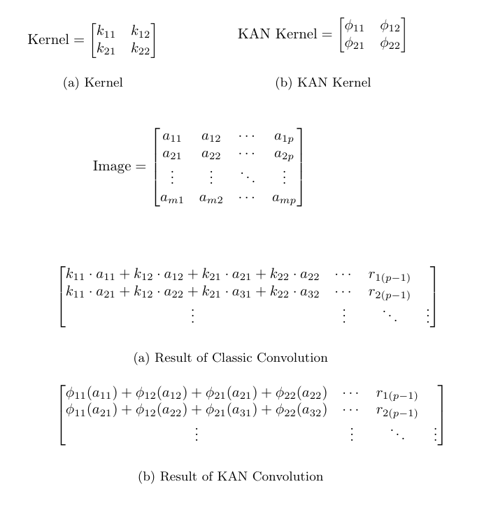
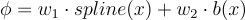
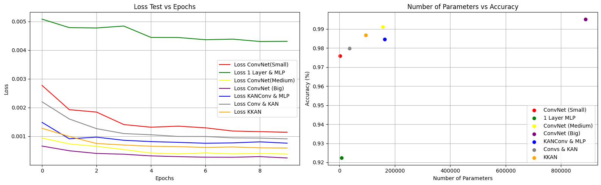

# Convolutional Kolmogorov-Arnold Network (CKAN) 

## Paper
All the mathematical explanation and experiments are explained in the 
[Academic Paper](https://arxiv.org/abs/2406.13155)

### Introducing Convolutional KAN Networks!
This project extends the idea of the innovative architecture of Kolmogorov-Arnold Networks (KAN) to the Convolutional Layers, changing the classic linear transformation of the convolution to learnable non linear activations in each pixel. 
## Authors
This repository was made by:
 - Alexander Bodner | abodner@udesa.edu.ar | [Twitter](https://twitter.com/AlexBodner_) | [LinkedIn](https://www.linkedin.com/in/alexanderbodner/)
 - Antonio Tepsich | atepsich@udesa.edu.ar | [Twitter](https://twitter.com/antotepsich) | [LinkedIn](https://www.linkedin.com/in/antonio-tepsich/)
 - Jack Spolski | jspolski@udesa.edu.ar | [LinkedIn](https://www.linkedin.com/in/jack-spolski-9882a3196/)
 - Santiago Pourteau | spourteau@udesa.edu.ar | [Twitter](https://twitter.com/SantiPourteau) | [LinkedIn](https://www.linkedin.com/in/santiago-pourteau-1bba8619a/)

### Credits
This repository uses an efficient implementation of KAN which is available [here](https://github.com/Blealtan/efficient-kan).
The original implementation of KAN is available [here](https://github.com/KindXiaoming/pykan). 
The original paper of the KAN is available [here](https://arxiv.org/pdf/2404.19756).

### What is a KAN?
KANs are promising alternatives of Multi-Layer Perceptrons (MLPs). KANs have strong mathematical foundations just like MLPs: MLPs are based on the universal approximation theorem, while KANs are based on Kolmogorov-Arnold representation theorem. KANs and MLPs are dual: KANs have activation functions on edges, while MLPs have activation functions on nodes. KAN seems to be more parameter efficient than MLPs, but each KAN Layer has more parameters than a MLP layer. 


For more information about this novel architecture please visit:
- The official Pytorch implementation of the architecture: https://github.com/KindXiaoming/pykan
- The research paper: https://arxiv.org/abs/2404.19756

### What is a KAN Convolution?
KAN Convolutions are very similar to convolutions, but instead of applying the dot product between the kernel and the corresponding pixels in the image, we apply a **Learnable Non Linear activation function** to each element, and then add them up. The kernel of the KAN Convolution is equivalent to a KAN Linear Layer of 4 inputs and 1 output neuron. For each input i, we apply a ϕ_i learnable function, and the resulting pixel of that convolution step is the sum of ϕ_i(x_i). This can be visualized in the following figure.




### Parameters in a KAN Convolution
Suppose that we have a KxK kernel. In this case, for each element of this matrix we have a ϕ, which its parameter count is: gridsize + 1. For implementation issues, efficient kan defines:


This gives more expressability to the activation function b. So the parameter count for a linear layer is gridsize + 2. So in total we have K²(gridsize + 2) parameters for KAN Convolution, vs only K² for a common convolution. Consider that gridsize is typically (in our experiments) between k and k², but k tends to be a small value, between 2 and 16. 
## Preliminary Evaluations
The different architectures we have tested are:
- KAN Convolutional Layers connected to Kan Linear Layers (KKAN)
- Kan Convolutional Layers connected to a MLP (CKAN)
- CKAN with Batch Normalization between convolutions (CKAN_BN)
- ConvNet (Classic Convolutions connected to a MLP) (ConvNet)
- Simple MLPs 



**Here we have some results:**
| Model               | Test Accuracy | Test Precision | Test Recall | Test F1 Score | Number of Parameters | Convolutional Layers |
|---------------------|---------------|----------------|-------------|---------------|----------------------|----------------------|
| 1 Layer MLP         | 0.922         | 0.922          | 0.921       | 0.921         | 7850                 |          -           |
| ConvNet (Small)     | 0.976         | 0.976          | 0.976       | 0.976         | 2740                 |  [5,1] k=[3,3]       |
| ConvNet (Medium)    | 0.991         | 0.991          | 0.991       | 0.991         | 157 030               | [5,5] k=[3,3]       |
| ConvNet (Big)       | **0.995**     | 0.995          | 0.995       | 0.995         | 887 530               | [32,1,2,1] k=[5,5,3,3] |
| KANConv & MLP       | 0.985         | 0.985          | 0.984       | 0.984         | 163 726               |KanConvs[5,5] k =[3,3] |
| Simple Conv & KAN   | 0.980         | 0.980          | 0.980       | 0.980         | 37 030                |    [5,1] k=[3,3]  |
| KKAN                | 0.987         | 0.987          | 0.987       | 0.987         | 94 650                | KanConvs[5,5] k =[3,3]|

*The lists in Convolutional Layers contain in each element the number of convolutions and then the corresponding kernel size.*
 
 Based on a 28x28 MNIST dataset, we can observe that the KANConv & MLP model achieves acceptable accuracy compared to the ConvNet (Big). However, the difference is that the number of parameters required by the KANConv & MLP is seven times less than those needed by the standard ConvNet. Also the KKAN achieved 0.04 less Accuracy than ConvNet Medium, with almost half the parameter count (94k vs 157k), which shows the potential of the architecture. Experiments on more datasets need to be conducted to take certain conclussions on this.

### Discussion

The implementation of KAN Convolutions is a promising idea, although it is still in its early stages. We have conducted some preliminary experiments to evaluate the performance of KAN Convolutions. The reason we say preliminary is because we wanted to publish this idea as soon as possible, so that the community can start working on it. 

We are aware that there are many hyperparameters to tune, and many experiments to conduct. In the coming days and weeks we will be thoroughly tuning the hyperparameters of our model and the models we use to compare. We have tried some variations in the hyperparameters and architectures, but it was heuristically and not done with any precise method. 
We also recognize that we have not used large or more complex datasets because of computational power and time reasons and we are working on that.  
We will be conducting experiments on more complex datasets in the future, this implies that the amount parameters of the KANS will increase since we will need to implement more Kan Convolutional layers.

### Conclusion
At the moment we aren't seeing a significant improvement in the performance of the KAN Convolutional Networks compared to the traditional Convolutional Networks. We believe that this is due to the fact that we are using simple datasets and small models since the strength of our architecture lies in its requirement for significantly fewer parameters compared to the best architecture we have tried (ConvNet Big, which is an unfair comparison because of its size). The comparison between 2 equal convolutional and KAN convolutional layers with the same MLP connected at the end showed a small win to the classic approach, getting 0.06 better accuracy, while the KAN convolutions and a KAN Linear Layer with almost half the parameter count got 0.04 less Accuracy. We are confident that as we increase the complexity of the models and the datasets we will see a significant improvement in the performance of the KAN Convolutional Networks. But also the parameter count of our models will grow faster with higher dimentional inputs. 

### Work in progress
- Experiments on more complex datasets.
- Hyperparameter tuning with Random Search.
- Experiments with more architectures.
- Dinamically updating grid ranges.

# Installation
```bash
git clone git@github.com/AntonioTepsich/ckan.git
cd Convolutional-KANs
pip install -r requirements.txt
```
# Usage
Just copy the file `kan_convolutional` to your project and import it.
```python
from kan_convolutional.KANConv import KAN_Convolutional_Layer
```
# Example
Construct a KANConv for MNIST
```python
import torch
from torch import nn
import torch.nn.functional as F

from kan_convolutional.KANConv import KAN_Convolutional_Layer

class KANC_MLP(nn.Module):
    def __init__(self,device: str = 'cpu'):
        super().__init__()
        self.conv1 = KAN_Convolutional_Layer(
            n_convs = 5,
            kernel_size= (3,3),
            device = device
        )

        self.conv2 = KAN_Convolutional_Layer(
            n_convs = 5,
            kernel_size = (3,3),
            device = device
        )

        self.pool1 = nn.MaxPool2d(
            kernel_size=(2, 2)
        )
        
        self.flat = nn.Flatten() 
        
        self.linear1 = nn.Linear(625, 256)
        self.linear2 = nn.Linear(256, 10)


    def forward(self, x):
        x = self.conv1(x)

        x = self.pool1(x)

        x = self.conv2(x)
        x = self.pool1(x)
        x = self.flat(x)
        x = self.linear1(x)
        x = self.linear2(x)
        x = F.log_softmax(x, dim=1)
        return x
```

## Contributing
We invite the community to join us in advancing this project. There are numerous ways to contribute. You are welcome to contribute by submitting pull requests or opening issues to share ideas and suggest enhancements. Together, we can unlock the full possibilities of KAN and push the boundaries of Computer Vision ❤️.
