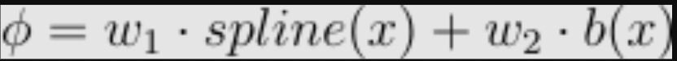

# Convolutional Kolmogorov-Arnold Network (CKAN) 

## Paper
All the mathematical explanation and experiments are explained in the 
[Academic Paper](https://arxiv.org/abs/2406.13155)

### Introducing Convolutional KAN Networks!
This project extends the idea of the innovative architecture of Kolmogorov-Arnold Networks (KAN) to the Convolutional Layers, changing the classic linear transformation of the convolution to learnable non linear activations in each pixel. 
## Authors
This repository was made by:
 - Alexander Bodner | abodner@udesa.edu.ar | [Twitter](https://twitter.com/AlexBodner_) | [LinkedIn](https://www.linkedin.com/in/alexanderbodner/)
 - Antonio Tepsich | atepsich@udesa.edu.ar | [Twitter](https://twitter.com/antotepsich) | [LinkedIn](https://www.linkedin.com/in/antonio-tepsich/)
 - Jack Spolski | jspolski@udesa.edu.ar | [LinkedIn](https://www.linkedin.com/in/jack-spolski-9882a3196/)
 - Santiago Pourteau | spourteau@udesa.edu.ar | [Twitter](https://twitter.com/SantiPourteau) | [LinkedIn](https://www.linkedin.com/in/santiago-pourteau-1bba8619a/)

### Credits
This repository uses an efficient implementation of KAN which is available [here](https://github.com/Blealtan/efficient-kan).
The original implementation of KAN is available [here](https://github.com/KindXiaoming/pykan). 
The original paper of the KAN is available [here](https://arxiv.org/pdf/2404.19756).

### What is a KAN?
KANs are promising alternatives of Multi-Layer Perceptrons (MLPs). KANs have strong mathematical foundations just like MLPs: MLPs are based on the universal approximation theorem, while KANs are based on Kolmogorov-Arnold representation theorem. KANs and MLPs are dual: KANs have activation functions on edges, while MLPs have activation functions on nodes. KAN seems to be more parameter efficient than MLPs, but each KAN Layer has more parameters than a MLP layer. 


For more information about this novel architecture please visit:
- The official Pytorch implementation of the architecture: https://github.com/KindXiaoming/pykan
- The research paper: https://arxiv.org/abs/2404.19756

### What is a KAN Convolution?
KAN Convolutions are very similar to convolutions, but instead of applying the dot product between the kernel and the corresponding pixels in the image, we apply a **Learnable Non Linear activation function** to each element, and then add them up. The kernel of the KAN Convolution is equivalent to a KAN Linear Layer of 4 inputs and 1 output neuron. For each input i, we apply a ϕ_i learnable function, and the resulting pixel of that convolution step is the sum of ϕ_i(x_i). This can be visualized in the following figure.


### Parameters in a KAN Convolution
Suppose that we have a KxK kernel. In this case, for each element of this matrix we have a ϕ, which its parameter count is: gridsize + 1. For implementation issues, efficient kan defines:


This gives more expressability to the activation function b. So the parameter count for a linear layer is gridsize + 2. So in total we have K²(gridsize + 2) parameters for KAN Convolution, vs only K² for a common convolution. Consider that gridsize is typically (in our experiments) between k and k², but k tends to be a small value, between 2 and 16. 
## Results
The different architectures we have tested are:
- KAN Convolutional Layers connected to Kan Linear Layers (KKAN)
- Kan Convolutional Layers connected to a MLP (KANC MLP)
- CKAN with Batch Normalization between convolutions (CKAN_BN)
- CNN (Classic Convolutions connected to a MLP) 
- Normal Conv & KAN (Classic Convolutions and KANs after the flatten.
They can be seen in the following Figures:

**CNN architectures**

**KAN  architectures**


The experiments were run using the script: "hiperparam_tuning_without_cv_fashion.py"

| Model                          | Accuracy | Precision | Recall | F1 Score | # Params | Minutes per epoch |
|--------------------------------|----------|-----------|--------|----------|----------|--------------------|
| CNN (Medium, but with more convs) | 89.56%   | 89.60%    | 89.56% | 89.55%   | 6.93K    | 0.2103             |
| CNN (Big)                      | 89.44%   | 89.40%    | 89.44% | 89.39%   | 26.62K   | 0.2114             |
| CNN (Medium)                   | 88.34%   | 88.20%    | 88.34% | 88.22%   | 3.02K    | 0.2103             |
| CNN (Small)                    | 87.10%   | 87.08%    | 87.10% | 87.01%   | 1.54K    | 0.2328             |
| Conv & KAN (Medium) (gs = 10)  | 87.92%   | 87.84%    | 87.92% | 87.80%   | 38.01K   | 0.2306             |
| Conv & KAN (Medium) (gs = 20)  | 87.90%   | 88.08%    | 87.90% | 87.95%   | 63.01K   | 0.2266             |
| Conv & KAN (Small) (gs = 10)   | 87.55%   | 87.37%    | 87.55% | 87.42%   | 19.03K   | 0.2303             |
| Conv & KAN (Small) (gs = 20)   | 87.67%   | 87.74%    | 87.67% | 87.59%   | 31.53K   | 0.2254             |
| KANC MLP (Big) (gs = 10)       | 89.15%   | 89.22%    | 89.15% | 89.14%   | 33.54K   | 1.6523             |
| KANC MLP (Big) (gs = 20)       | 89.11%   | 89.05%    | 89.11% | 89.06%   | 38.48K   | 2.4633             |
| KANC MLP (Medium) (gs = 10)    | 88.99%   | 88.97%    | 88.99% | 88.96%   | 9.94K    | 1.6441             |
| KANC MLP (Medium) (gs = 20)    | 88.90%   | 88.85%    | 88.90% | 88.83%   | 14.89K   | 2.4615             |
| KANC MLP (Small) (gs = 10)     | 87.43%   | 87.41%    | 87.43% | 87.41%   | 5.31K    | 1.1704             |
| KANC MLP (Small) (gs = 20)     | 88.15%   | 88.02%    | 88.15% | 87.94%   | 8.01K    | 1.6262             |
| KKAN (Medium) (gs = 10)        | 87.91%   | 88.37%    | 87.91% | 87.99%   | 44.93K   | 1.6425             |
| KKAN (Medium) (gs = 20)        | 88.56%   | 88.52%    | 88.56% | 88.52%   | 74.88K   | 2.4753             |
| KKAN (Small) (gs = 10)         | 88.01%   | 87.87%    | 88.01% | 87.76%   | 22.80K   | 1.1599             |
| KKAN (Small) (gs = 20)         | 87.94%   | 87.80%    | 87.94% | 87.72%   | 38.00K   | 1.6336             |

 
The results analysis can be seen in the paper. 


### Conclusion
 We have found out that with equal architectures, KAN Convolutions seem to "learn more", showing better accuracy in the analogous models except in the "Big" ones, where the difference was that we added more fully connected layers, which may be doing the learning instead of the convolutions. 

When using KANs after the flatten, KAN Convolutions achieve better accuracy than we can classic convolutions even using half the parameters. This is seen in the comparisons between KKAN and Normal Conv \& KAN. 

When trying an MLP, KAN convolutions achieve higher accuracy in the small models, but when having a 2 layer MLP, the classic CNN wins by 0.41\% with $\sim 26.62$k parameters. But the key factor is that KANs seem to maintain accuracy with lower parameter count, KANC MLP (Medium) achieves 88.99 with almost $15K$ parameters, but the training time is almost 10 times slower with the current implementations of KANs and its derivatives.  

Also, MLPs show a better performance than KANs for image classification tasks. In the "Small" and "Medium" cases, when using KAN Convolutions, using MLPs after the flatten gives both better accuracy and smaller parameters counts than using KANs. As expected, KKANs achieve better accuracy than its equal CNNs, but the parameter count difference is too big (22k vs 1.5k and 38k vs 3k).


### Work in progress
- Experiments on more complex datasets.
- Experiments with more architectures.


# Installation
```bash
git clone git@github.com/AntonioTepsich/ckan.git
cd Convolutional-KANs
pip install -r requirements.txt
```
# Usage
Just copy the file `kan_convolutional` to your project and import it.
```python
from kan_convolutional.KANConv import KAN_Convolutional_Layer
```
# Example
Construct a KANConv for MNIST
```python
import torch
from torch import nn
import torch.nn.functional as F

from kan_convolutional.KANConv import KAN_Convolutional_Layer

class KANC_MLP(nn.Module):
    def __init__(self,grid_size: int = 5):
        super().__init__()
        self.conv1 = KAN_Convolutional_Layer(in_channels=1,
            out_channels= 5,
            kernel_size= (3,3),
            grid_size = grid_size
        )

        self.conv2 = KAN_Convolutional_Layer(in_channels=5,
            out_channels= 5,
            kernel_size = (3,3),
            grid_size = grid_size
        )

        self.pool1 = nn.MaxPool2d(
            kernel_size=(2, 2)
        )
        
        self.flat = nn.Flatten() 
        
        self.linear1 = nn.Linear(125, 10)
        self.name = f"KANC MLP (Small) (gs = {grid_size})"


    def forward(self, x):
        x = self.conv1(x)

        x = self.pool1(x)

        x = self.conv2(x)
        x = self.pool1(x)
        x = self.flat(x)
        #print(x.shape)
        x = self.linear1(x)
        x = F.log_softmax(x, dim=1)
        return x
```

## Contributing
We invite the community to join us in advancing this project. There are numerous ways to contribute. You are welcome to contribute by submitting pull requests or opening issues to share ideas and suggest enhancements. Together, we can unlock the full possibilities of KAN and push the boundaries of Computer Vision ❤️.
